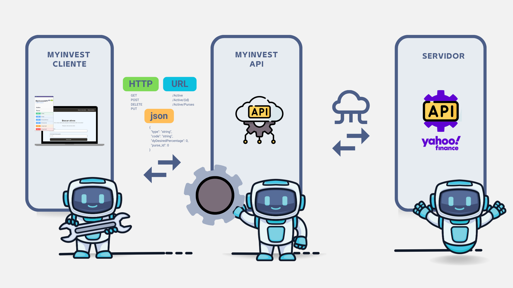
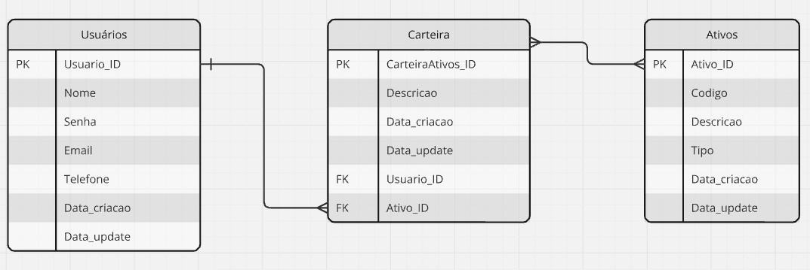

# 💰 MyInvest
<a style="color:yellow;">PROJETO EM DESENVOLVIMENTO </a>

**MyInvest** é uma aplicação web composta por uma API desenvolvida em **C# | ASP.NET** e um cliente web em **Angular**. O objetivo do sistema é fornecer informações detalhadas sobre a carteira de ativos dos usuários, calculando o preço-teto (modelo de Bazin) para ações e FIIs e sugerindo a compra ou não do ativo com base no preço atual < preço-teto.

## 🎯 Objetivo

O principal objetivo do **MyInvest** é ajudar investidores a tomar decisões informadas sobre a compra de ações e FIIs, com base no cálculo do preço-teto segundo o modelo de Décio Bazin. A aplicação oferece uma interface intuitiva para que os usuários possam visualizar e gerenciar suas carteiras de ativos, recebendo sugestões de compra ou venda.

## 📊 Apresentação


## ✅ Funcionalidades Principais

- **Cálculo do Preço-Teto**: Utiliza o modelo de Décio Bazin para calcular o preço-teto de ações e FIIs, indicando se o ativo está abaixo do valor ideal para compra.
- **Sugestão de Compra**: Com base no preço-teto e no preço atual, a aplicação sugere se o usuário deve comprar ou não o ativo.
- **Gestão de Carteira**: Permite que os usuários visualizem, adicionem e removam ativos de sua carteira, mantendo um histórico de decisões.
- **Interface Amigável**: O sistema conta com uma interface moderna e responsiva desenvolvida em Angular, facilitando o acesso às informações.

## 🧩 Arquitetura do Sistema

O sistema é composto por dois principais componentes:

1. **MyInvestAPI**: API desenvolvida em C# | ASP.NET, responsável por processar os dados financeiros, calcular o preço-teto dos ativos e expor os endpoints necessários para que o cliente web consuma essas informações.
2. **MyInvestClient**: Cliente web desenvolvido em Angular, que consome a API e oferece uma interface amigável para os usuários visualizarem e gerenciarem suas carteiras de ativos.

## 📊 Diagrama do Sistema

Abaixo está o diagrama do sistema **MyInvest**, que ilustra a arquitetura e os principais componentes da aplicação e o diagrama de entidade e relacionamento. Este diagrama mostra a estrutura lógica de um banco de dados, incluindo as entidades (tabelas), os atributos (colunas) e os relacionamentos entre essas entidades.


<small>Imagem: Diagrama do Sistema</small>


<small>Imagem: Diagrama ER</small>

Este diagrama descreve a interação entre os módulos **MyInvestAPI** e **MyInvestClient**, destacando como os dados de ativos são processados e apresentados ao usuário final. A API calcula o preço-teto (segundo o modelo Bazin) e, com base nesse cálculo, o cliente web sugere se o usuário deve ou não comprar o ativo.

## 📘 Fórmula do Preço-Teto segundo Décio Bazin

### Fórmula

$$
\text{Preço Teto} = \frac{\text{Dividendo Médio por Ação}}{\text{Taxa de Retorno Desejada}}
$$

### Explicação dos Elementos

- **Preço Teto**: Valor máximo que você deve pagar por uma ação para que o investimento atenda à taxa de retorno desejada com base nos dividendos.
- **Dividendo Médio por Ação**: Média dos dividendos pagos por ativo ao longo de um período específico (geralmente 5 anos).
- **Taxa de Retorno Desejada**: Taxa mínima de retorno desejada pelo investidor (geralmente ≥ 6% ao ano para ações e ≥ 8% para FIIs).

### Exemplo de Cálculo

- **Dividendo Médio por Ação**: R$ 3,00
- **Taxa de Retorno Desejada**: 8% (ou 0,08)

O cálculo seria:
$$
\text{Preço Teto} = \frac{R\$ 3,00}{0,08} = R\$ 37,50
$$

Se o preço de mercado da ação estiver abaixo de R$ 37,50, pode ser considerada uma boa compra.

## 📄 Exemplos de Retorno

### Modelo para listar os ativos (ações e FIIs):

Exemplo de retorno para um ativo:

```
- Data..........................................: 16/08/2024
- Ativo.........................................: PETR4
- Nome do ativo.................................: Petróleo Brasileiro S.A
- Tipo (Ação ou FII)............................: Ação
- Dividend Yield (DY)...........................: 8.5%
- Preço atual...................................: R$ 28,50
- P/VP (Preço/Valor Patrimonial)................: 1.2
- Preço-Teto (modelo Bazin).....................: R$ 30,00
- Indicação (🟢 comprar ou 🔴 não-comprar).....: 🟢 Comprar
- Outros campos relevantes:
  - P/L (Preço/Lucro)...........................: 6.5
  - ROE (Retorno sobre Patrimônio)..............: 18%
  - Crescimento de Dividendos (5 anos)..........: 4% ao ano
```

### Tabela Exemplo
Exemplo de retorno para múltiplos ativos:


| **ID** | **Ativo** | **Empresa**             | **Tipo** | **Dividend Yield (DY)** | **Preço atual** | **P/VP** | **Preço-Teto** | **Indicação** | **P/L** | **ROE** |
| ------ | --------- | ----------------------- | -------- | ----------------------- | --------------- | -------- | -------------- | ------------- | ------- | ------- |
| 1      | PETR4     | Petróleo Brasileiro S.A | Ação     | 8.5%                    | R$ 28,50        | 1.2      | R$ 30,00       | 🟢            | 6.5     | 18%     |
| 2      | PORD11    | PORD Imobiliário FII    | FII      | 7.2%                    | R$ 100,00       | 0.9      | R$ 105,00      | 🟢            | 10.0    | 12%     |
| 3      | BBSA4     | Banco do Brasil S.A     | Ação     | 6.7%                    | R$ 45,00        | 1.3      | R$ 47,00       | 🟢            | 8.0     | 15%     |
| 4      | GARE11    | GARE Imobiliário FII    | FII      | 5.8%                    | R$ 120,00       | 1.1      | R$ 115,00      | 🔴            | 12.0    | 10%     |

**Legenda**: 🟢 Comprar ou 🔴 Não-comprar  
**Carteira**: 01 Aposentadoria  
**Última Atualização**: 16/08/2024 09h03  


## ⚙️ Como Rodar o Projeto

### Pré-requisitos

- **Docker**: Certifique-se de ter o Docker instalado e rodando na sua máquina.recebendo sugestões de compra ou venda.


## ⚙️Como rodar o projeto:
1. Tenha o Docker instalado e rodando na sua máquina.
2. Clone o projeto na sua máquina:
```
git clone https://gitlab.com/marcosmoraisjr/myinvest.net.git
```
3. Acesse a pasta do projeto:
```
cd myinvest.net
```
4. Com o Docker ativo, execute o comando abaixo para acionar o Docker-compose:
```
docker-compose up --build
```

## 🌐 Como Acessar o Projeto

### 🖥️ Interface do Usuário

A interface do programa pode ser acessada logo após a inicialização do projeto, utilizando a seguinte URL:
```
http://localhost:9090
```

### 📚 Documentação da API

A documentação completa da API, incluindo todos os endpoints e detalhes, está disponível via Swagger:
```
http://localhost:8080/swagger/index.html
```
  

## 🏆 Equipe de Desenvolvimento:
  
  * Marcos Morais <br />
    <mmstec@gmail.com>
  * Gabriel Rodriguez <br />
    <contatogabrielcruzrodrigues@gmail.com>

## 📝 Licença

Este projeto é licenciado sob a [Apache License 2.0](https://www.apache.org/licenses/LICENSE-2.0), com as seguintes condições adicionais:

  ### Licença de Uso Restrito:

  Este software é licenciado sob os seguintes termos:

  1. **Uso Restrito**: Este software não pode ser usado, modificado ou distribuído sem a permissão explícita do autor.
  2. **Atribuição de Autoria**: Qualquer uso autorizado deste software deve incluir a atribuição clara da autoria ao autor.
  3. **Proibições**: É estritamente proibido copiar, modificar, distribuir ou vender este software sem a autorização prévia por escrito do autor.
  4. **Consequências da Violação**: Qualquer violação dos termos acima resultará em medidas legais apropriadas.